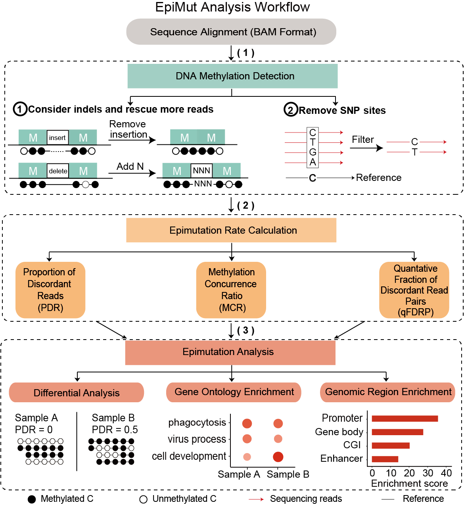

# EpiMut

- **Description**: EpiMut is for the fast and accurate quantification of epimutation based on DNA methylation sequencing data. Three types of epimutation scores were included in the EpiMut: i) proportion of discordant reads (**PDR**), ii) methylation concurrence ratio (**MCR**), and iii) quantitative fraction of discordant read pairs (**qFDRP**). **MCR** conceptualizes the concurrence of DNA methylation and demethylation and calculates the ratio of unmethylated CpGs from all partially methylated reads. **qFDRP** captures pairwise discordance between reads at the individual CpG level. **PDR** measures the locally disordered methylation states and calculates the ratio of discordantly methylated reads over the total reads, which has been proved to successfully reflect the epigenetic variability across cell differentiation. To comprehensively describe the DNA methylation epimutation characteristics, we implemented some advanced analysis modules including **the detection of differential epimutation regions and the enrichment for gene ontology and genomic feature**.

  

  

  

- **Version**: 1.0.0

- **System requirements**

  - Install [Julia]([Download Julia (julialang.org)](https://julialang.org/downloads/)) (at least Julia 1.5)

    - wget julia-*.tar.gz

    - tar -xzvf julia-*.tar.gz

    - export PATH=/julia_install_path/bin/:$PATH

  - Install Julia Packages from the julia REPL. Press `]` to enter pkg mode again, and enter the following

    - **BioSequences** (v3.1.1)

      ```julia
      add BioSequences@3.1.1
      ```

    - **XAM** (v0.3.1)

      ```julia
      add XAM@0.3.1
      ```

    - **GenomicFeatures** (v2.0.5)

      ```julia
      add GenomicFeatures@2.0.5
      ```

    - **CSV** (v0.10.7)

      ```julia
      add CSV@0.10.7
      ```

    - **FATSX** (v2.0.0)

      ```julia
      add FATSX@v2.0.0
      ```

    - **DataFrames** (v1.4.3)

      ```julia
      add DataFrames@1.4.3
      ```

    - **Getopt** (v0.1.0)

      ```julia
      add Getopt@0.1.0
      ```

    - **HypothesisTests** (v0.10.11)

      ```julia
      add HypothesisTests@0.10.11
      ```

    - **MultipleTesting** (v0.5.1)

      ```julia
      add MultipleTesting@v0.5.1
      ```

    - **StatsBase** (v0.33.21)

      ```julia
      add StatsBase@0.33.21
      ```

    - **RCall** (v0.13.14)

      ```julia
      add RCall@0.13.14
      ENV["R_HOME"] = "..." #input your R path. 
      #For example "/share/home/zhangchunyong/anaconda3/envs/R/lib/R/"
      using Pkg;Pkg.build RCall
      ```

  - Install R packages

    ```R
    install.packages("BiocManager")
    install.packages("ggplot2")
    BiocManager::install("LOLA")
    BiocManager::install("clusterProfiler")
    BiocManager::install("org.Hs.eg.db")
    BiocManager::install("org.Mm.eg.db")
    ```

  - Install [CGmaptools](https://cgmaptools.github.io/)

    - wget cgmaptools-*.tar.gz
    - tar -xzvf cgmaptools-*.tar.gz
    - cd cgmaptools.X.X.X
    - sh ./install.sh

  - Install [SAMtools](http://samtools.sourceforge.net/)

    - wget samtools-*.tar.bz2
    - tar -xjvf samtools-*.tar.bz2
    - cd samtools-*
    - ./configure --prefix=/samtools_install_path/
    - make
    - make install
    - export PATH=/samtools_install_path/:$PATH

  - Install [BEDtools]([Installation — bedtools 2.30.0 documentation](https://bedtools.readthedocs.io/en/latest/content/installation.html))

    - wget bedtools-*.tar.gz
    - tar -xzvf bedtools-*.tar.gz
    - cd bedtools
    - make
    - export PATH=/bedtools_install_path/:$PATH

- **Subcommands**:

  1. **calculate Epimutation Rate**:

     1. 1 **calculate PDR**:

     - **Description**:  This program is for calculating the proportion of discordant reads (PDR) from the BAM. The BAM index (.bai) should be in the same file as the BAM. The fasta index (.fai) should be in the same file as the fasta.

     - **Usage**: `julia calculatePDR.jl [options] -b <in.bam> -g <in.fa> -n <outputname> -o <outputfile>`

       ```
       -h      --help          Show this message
       -b      --bamfile       Input your BAM file, should be in the same file as the bai (generated by 						 samtools index).
       -g      --genomefile    Input your genome file, should be in the same file as the fai (generated    					    by samtools faidx).
       -r      --readscg       Input at least the number of C loci in a read. [Default: 4]
       -c      --coverage      Input at least the number of reads containing a C locus. [Default: 1]
       -R      --rmMXY         When using this parameter as true, we only calculate PDR of autosomes 							without chrM, chrX, chrY.
                               When using this parameter as false, we calculate PDR of all chromosomes. 						 [Default: true]
       -n      --name          Input output name, stored as a csv format.
       -o      --outputfile    Input output file path.
       -t      --threads       Input number of threads to calculate PDR. 
       						And this parameter should follow immediately after julia,
       					    like "julia -t 20 ***.jl ...". [Default: 1]
       ```

     - **Example**: `julia -t 20 calculatePDR.jl -b Sample.bam -g genome.fa -r 4 -c 1 -R true -n pdr -o /share/home/zhangchunyong/EpiMutresult `

     1. 2 **calculate MCR**:   

     - **Description**: This program is for calculating methylation concurrence ratio (MCR) from the BAM. The BAM index (.bai) should be in the same file as the BAM. The fasta index (.fai) should be in the same file as the fasta.

     - **Usage**: `julia calculateMCR.jl [options] -b <in.bam> -g <in.fa> -n <outputname> -o <outputfile>`
     
       ```
       -h      --help          Show this message
       -b      --bamfile       Input your BAM file, should be in the same file as the bai (generated by 						 samtools index).
       -g      --genomefile    Input your genome file, should be in the same file as the fai (generated 						 by samtools faidx).
       -c      --coverage      Input at least the number of reads covering a C locus. [Default: 1]
       -R      --rmMXY         When using this parameter as true, we only calculate MCR of autosomes 							without chrM, chrX, chrY.
                               When using this parameter as false, we calculate MCR of all chromosomes. 						 [Default: true]
       -n      --name          Input output name, stored as a csv format.
       -o      --outputfile    Input output file path.
       -t      --threads       Input number of threads to calculate MCR. 
       						And this parameter should follow immediately after julia,
       					    like "julia -t 20 ***.jl ...". [Default: 1]
       ```

     - **Example**: `julia -t 20 calculateMCR.jl -b Sample.bam -g genome.fa -c 1 -R true -n mcr -o /share/home/zhangchunyong/EpiMutresult`

     1. 3 calculate qFDRP

     - **Description**: This program is for calculating quantative fraction of discordant read pairs (qFDRP) from the BAM. The BAM index (.bai) should be in the same file as the BAM. The fasta index (.fai) should be in the same file as the fasta.
     
     - **Usage**: `julia calculateqFDRP.jl [options] -b <in.bam> -g <in.fa> -n <outputname> -o <outputfile>`
     
       ```
       -h      --help          Show this message
       -b      --bamfile       Input your BAM file, should be in the same file as the bai (generated by 						 samtools index).
       -g      --genomefile    Input your genome file, should be in the same file as the fai (generated 						 by samtools faidx).
       -m      --minoverlap    Input at least the number of overlap bases of each read pair. 
       						[Default: 35]
       -w      --windowsize    Input the maximum distance used to restrict the concordance/discordance 						classification of each read pair. [Default: 50]
       -r      --readpaircg    Input at least the number of each read pair's overlaping C loci. 								[Default: 2]
       -c      --coverage      Input at least the number of reads covering a C locus.The coverage must be 						   more than 1. [Default: 2]
       -R      --rmMXY         When using this parameter as true, we only calculate qFDRP of autosomes 						without chrM, chrX, chrY.
                               When using this parameter as false, we calculate qFDRP of all chromosomes. 						   [Default: true]
       -n      --name          Input output name, stored as a csv format.
       -o      --outputfile    Input output file path.
       -t      --threads       Input number of threads to calculate qFDRP. 
       						And this parameter should follow immediately after julia,
       					    like "julia -t 20 ***.jl ...". [Default: 1]
       ```
     
     - **Example**: `julia -t 20 calculateqFDRP.jl -b Sample.bam -g genome.fa -m 35 -w 50 -r 2 -c 2 -R true -n qfdrp -o /share/home/zhangchunyong/EpiMutresult`

 2. **Differential analysis**：

    - **Description**: This program is for differential analysis between 2 groups using unpaired two-tailed Student's t-test.
    
    - **Usage**: `julia DiffAnalysis.jl [options] -i <inputfile> -b <bedfile> -n <outputname> -o <outputfile>`
    
      ```
      -h      --help              Show this message
      -i      --inputfile         Input your analysis table, which contains 2 columns (samplefile, group).
      -b      --bedfile           Input your region file (.bed).
      -H      --header            Input whether your bed has the header. [Default: true]
      -a      --addchrname        If the first column of your bed is "1" but not "chr1", you should input 							true. [Default: false]
      -r      --region_epinumber  Input at least the number of epimut values included in each region of 								bed. [Default: 5]
      -n      --name              Input output name, stored as a csv format.
      -o      --outputfile        Input output file path.
      -t      --threads           Input number of threads to generate differential analysis.
      							And this parameter should follow immediately after julia,
                                  like "julia -t 20 ***.jl ...". [Default: 1]
      ```
    
    - **Example**: `julia -t 20 DiffAnalysis.jl -i Sample.txt -b region.bed -H true -a false -r 5 -n diffanalysis -o /share/home/zhangchunyong/EpiMutresult `


  3. **Volcano Plot**：

     - **Description**: This program is for drawing volcano plot after differential analysis.

     - **Usage**: `julia VolcanoPlot.jl [options] -i <inputfile> -n <outputname> -o <outputfile>`

       ```
       -h      --help              Show this message
       -i      --inputfile         Input your diffrential analysis table, which was generated by 										DiffAnalysis.jl.
       -d      --deltacutoff       EpiMut rate difference cutoff between the two groups (group1 minus 		                          	 group2). [Default: 0.2]
       -p      --pvaluecutoff      Pvalue cutoff on enrichment tests to report. [Default: 0.05]
       -n      --name              Input output name, stored as a pdf format.
       -o      --outputfile        Input output file path.
       ```
     
     - **Example**: `julia VolcanoPlot.jl -i diff.csv -d 0.2 -p 0.05 -n volcano -o /share/home/zhangchunyong/EpiMutresult ` 

  4. **Circo Plot**

     - **Description**: This program is for drawing circle plot using cgmaptools tanghulu after differential analysis. Make sure your CGmaptools and SAMtools were installed. We try to search your CGmaptools and SAMtools.
       
     - **Usage**: `julia CircoPlot.jl [options] -b <in.bam> -g <in.fa> -c <chr> -s <start> -e <end> -n <outputname> -o <outputfile>`
     
       ```
       -h      --help              Show this message
       -b      --bamfile           Input your BAM file, should be in the same file as the bai (generated by 							 samtools index).
       -g      --genomefile        Input your genome file, should be in the same file as the fai (generated 							 by samtools faidx).
       -c      --chr               Chromosome name. eg. chr1
       -s      --start             Start position. eg. 2000
       -e      --end               End position. eg. 4000
       -n      --name              Input output name, stored as a pdf format.
       -o      --outputfile        Input output file path.
       ```
       
     - **Example**: `julia CircoPlot.jl -b Sample.bam -g genome.fa -c chr1 -s 2000 -e 4000 -n circoplot -o /share/home/zhangchunyong/EpiMutresult ` 
     
  5. **LOLA**

     - **Description**: This program is for the locus overlap analysis (LOLA) after differential analysis. Make sure your R has installed LOLA, ggplot2 package.

     - **Usage**:`julia LOLA.jl [options] -i <inputfile> -p <pvaluecutoff> -r <regiondb_path> -n <outputname> -o <outputfile>`

       ```
       -h      --help              Show this message
       -i      --inputfile         Input your differential analysis table, which was generated by 	    								DiffAnalysis.jl.   
       -p      --pvaluecutoff      Pvalue cutoff on enrichment tests to report. [Default: 0.05]
       -r      --regiondb_path     Input regiondb_path (For more information, please visit		 										https://databio.org/regiondb) for LOLA.
       -n      --name              Input output name, stored as a pdf and csv format.
       -o      --outputfile        Input output file path.
       ```

     - **Example**: `julia LOLA.jl -i diff.csv -p 0.05 -r /share/home/zhangchunyong/hg38 -n lola -o /share/home/zhangchunyong/EpiMutresult  `  

  6. **GO analysis** 

     - **Description**: This program is for gene ontology analysis after differential analysis. Make sure your BEDtools was installed. We try to search your BEDtools. Also make sure your R has installed clusterprofiler, org.Hs.eg.db / org.Mm.eg.db, ggplot2 package.

     - **Usage**: `julia GO.jl [options] -i <inputfile> -t <tssfile> -d <distance> -s <species> -p <pvaluecutoff> -q <qvaluecutoff> -n <outputname> -o <outputfile>`

       ```
       -h      --help              Show this message
       -i      --inputfile         Input your processed (signficant up or down regions) and sorted (use 								bedtools sort) differential analysis table (.bed).
       -t      --tssfile           Input all genes' transcrpition start sites (TSS) table (.bed).
       -d      --distance          Distance cutoff between significant feature and TSS. [Default: 1000]
       -s      --speices           Species for GO analysis (hg, mm). [Default: hg]
       -p      --pvaluecutoff      Adjusted pvalue cutoff on enrichment tests to report. [Default: 0.05]
       -q      --qvaluecutoff      Qvalue cutoff on enrichment tests to report as significant. 
       							[Default: 0.2]
       -n      --name              Input output name, stored as a pdf and csv format.
       -o      --outputfile        Input output file path.
       ```
     
     - **Example**: `julia GO.jl -i significant.bed -t tss.bed -d 1000 -s hg -p 0.05 -q 0.2 -n up_go -o /share/home/zhangchunyong/EpiMutresult ` 
     
     
     
     **Tips**:
     
     1. For paired-end BS-seq data, mapping each mate in single-end mode is recommended to generate BAM.
     
     2. Since Julia takes a long time to load packages, we can pre-compile to shorten the time to load packages in the julia REPL.
     
        For example:
     
        ```julia
        using PackageCompiler
        create_sysimage([:CSV,:DataFrames,:XAM,:GenomicFeatures,:FASTX,:BioSequences,:Getopt], sysimage_path="calculatePDR.so",precompile_execution_file="/share/home/zhangchunyong/EpiMut/calculatePDR.jl")
        create_sysimage([:CSV,:DataFrames,:XAM,:GenomicFeatures,:FASTX,:BioSequences,:Getopt], sysimage_path="calculateMCR.so",precompile_execution_file="/share/home/zhangchunyong/EpiMut/calulateMCR.jl")
        create_sysimage([:CSV,:DataFrames,:XAM,:GenomicFeatures,:FASTX,:BioSequences,:Getopt,:StatsBase], sysimage_path="calculateqFDRP.so",precompile_execution_file="/share/home/zhangchunyong/EpiMut/calulateqFDRP.jl")
        create_sysimage([:CSV,:DataFrames,:GenomicFeatures,:MultipleTesting,:HypothesisTests,:Getopt], sysimage_path="DiffAnalysis.so",precompile_execution_file="/share/home/zhangchunyong/EpiMut/DiffAnalysis.jl")
        create_sysimage([:RCall,:Getopt], sysimage_path="VolcanoPlot.so",precompile_execution_file="/share/home/zhangchunyong/EpiMut/VolcanoPlot.jl")
        create_sysimage([:RCall,:Getopt], sysimage_path="LOLA.so",precompile_execution_file="/share/home/zhangchunyong/EpiMut/LOLA.jl")
        create_sysimage([:RCall,:Getopt], sysimage_path="GO.so",precompile_execution_file="/share/home/zhangchunyong/EpiMut/GO.jl")
        ```
     
        then you can run the code like the following to make it faster
     
         `julia --sysimage calculatePDR.so -t 20 calculatePDR.jl -b Sample.bam -g genome.fa -r 4 -c 1 -R true -n pdr -o /share/home/zhangchunyong/`
     
     
     

- **Contact**:

  Chunyong Zhang; zhangchunyong@tmu.edu.cn